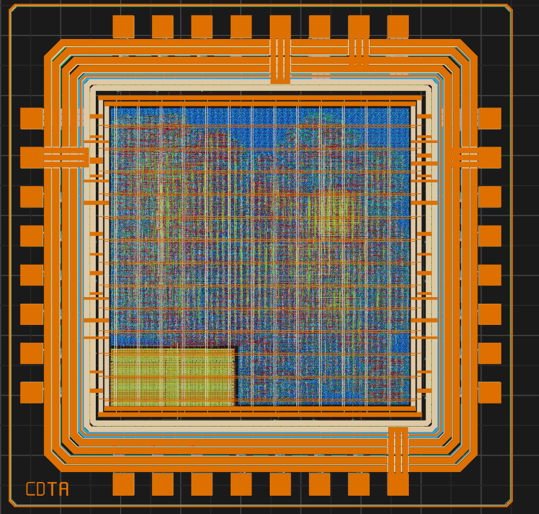

# MCU2972 — QoSoC

QoSoC is a 32-bit RISC-V MCU (RV32EC) designed for low-power IoT and embedded control applications.

---

## Features

| Category | Details |
|---|---|
| **CPU** | PicoRV32 RV32EC — 16 GPRs, no HW mul/div, 32 IRQ inputs |
| **Boot ROM** | 4 KB mask-programmed bootloader |
| **SRAM** | 2 KB — IHP `RM_IHPSG13_1P_512x32_c2_bm_bist` macro |
| **Flash** | QSPI XIP, up to 8 MB external |
| **GPIO** | 8-bit bidirectional, edge/level IRQ |
| **UART** | 16-byte FIFOs, configurable baud |
| **I2C** | Master, 100/400 kHz |
| **PTC** | 32-bit timer/counter, PWM, capture |
| **Dual RTC** | Calendar + alarm, 32.768 kHz domain |
| **Watchdog** | 32-bit auto-reload |
| **PMU** | 5-state power FSM, per-peripheral clock gating, 8 wake sources |
| **Debug** | Post-silicon debug over UART, SRAM MBIST |

## Documentation

- [Datasheet](doc/Datasheet.md) — specs, pinout, memory map, verification summary  
- [Specification](doc/Specification.md) — architecture, peripherals, register overview, physical implementation  
- [TRL Assessment](doc/TRL-Digital-Hard-IP.md) — technology readiness checklist  

## Release

The tapeout GDS is available at `release/v.1.0.0/gds/MCU2972.gds`.

Die: **1732 × 1732 µm** | Core: **~979 kµm²** | Std Cells: **38,326** (post-P&R) | Total Power: **~5.2 mW** @ 16 MHz

### Physical Implementation Highlights

| Check | Result |
|---|---|
| Setup violations | ✅ None |
| Hold violations | ✅ None |
| LVS | ✅ Passed |
| Antenna | ✅ Passed |
| Routing DRC | ✅ Clean |
| IR drop (VDD, worst) | 1.7 mV (0.14%) |

## Tooling & Infrastructure

The project utilizes the following open-source toolchain for physical design and verification:

| Tool | Version |
|---|---|
| **LibreLane** | 3.0.0 |
| **Verilator** | 5.044 |
| **Verible** | v0.2.1 |
| **Icarus Verilog** | 13.0 (devel) |
| **cocotb** | 1.9.2 |
| **PDK** | IHP SG13G2 (0418301...) |

## License

[Apache 2.0](LICENSE)
